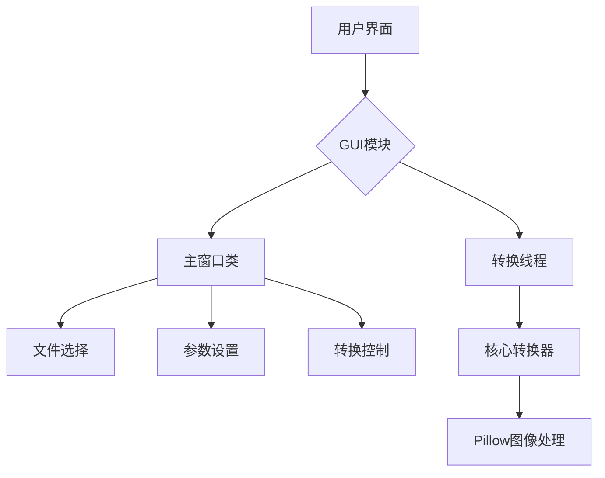

# 项目架构说明

## 概述
PNG转ICO转换器是一个桌面应用程序，用于将PNG格式的图像文件转换为Windows ICO图标格式。该应用程序采用模块化设计，将核心转换逻辑与图形用户界面分离。

## 架构图

## 模块说明

### 1. 主程序入口 (main.py)
- 程序的入口点
- 初始化Qt应用程序
- 创建并显示主窗口

### 2. 图形界面 (gui.py)
- `PngToIcoConverterGUI`: 主窗口类，负责用户界面交互
- `ConvertThread`: 转换线程类，用于在后台执行转换任务，避免阻塞UI

### 3. 核心转换逻辑 (converter.py)
- `PngToIcoConverterCore`: 核心转换类，包含实际的PNG到ICO转换逻辑
- 使用Pillow库进行图像处理
- 支持透明通道保留和高质量重采样

### 4. 常量定义
- `MAX_FILE_SIZE_MB`: 最大文件大小限制（5MB）
- `ICON_SIZE_MIN`: 最小图标尺寸（16px）
- `ICON_SIZE_MAX`: 最大图标尺寸（256px）
- `DEFAULT_ICON_SIZE`: 默认图标尺寸（64px）

## 设计模式

### MVC模式
- Model: `PngToIcoConverterCore` 类处理数据和业务逻辑
- View: Qt Widgets 构成的用户界面
- Controller: `PngToIcoConverterGUI` 类处理用户输入和界面更新

### 多线程模式
- 使用 `QThread` 在后台执行耗时的图像转换任务
- 通过信号和槽机制在主线程和工作线程之间通信
- 避免界面冻结，提供流畅的用户体验

## 数据流
1. 用户通过GUI选择PNG文件
2. GUI加载并预览图像
3. 用户设置转换参数（图标尺寸等）
4. 用户触发转换操作
5. GUI启动后台线程执行转换
6. 转换线程调用核心转换器进行实际处理
7. 转换进度通过信号反馈给GUI
8. 转换完成后通知用户结果

## 技术选型
- **GUI框架**: PyQt5
- **图像处理**: Pillow (PIL)
- **编程语言**: Python 3.7+